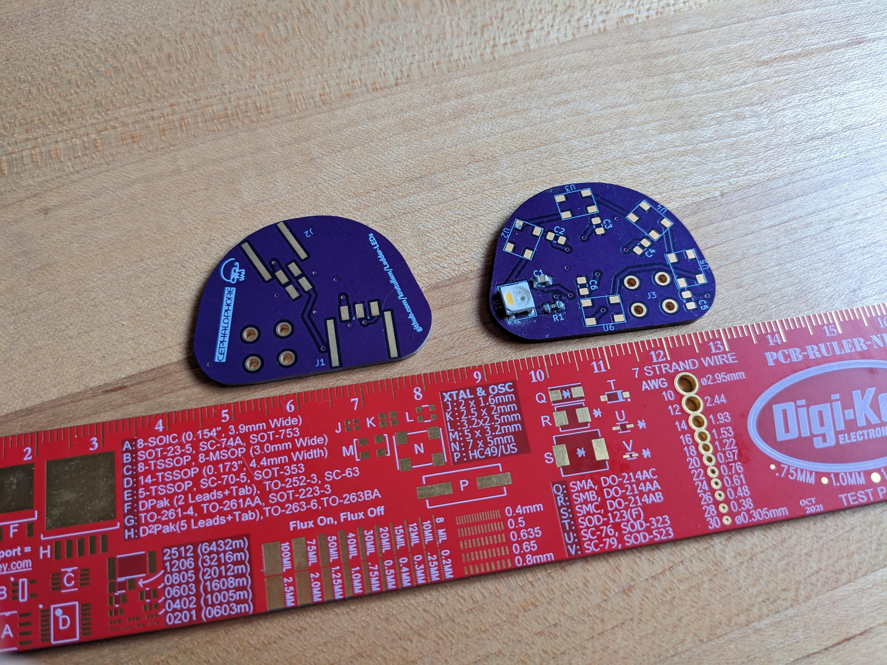
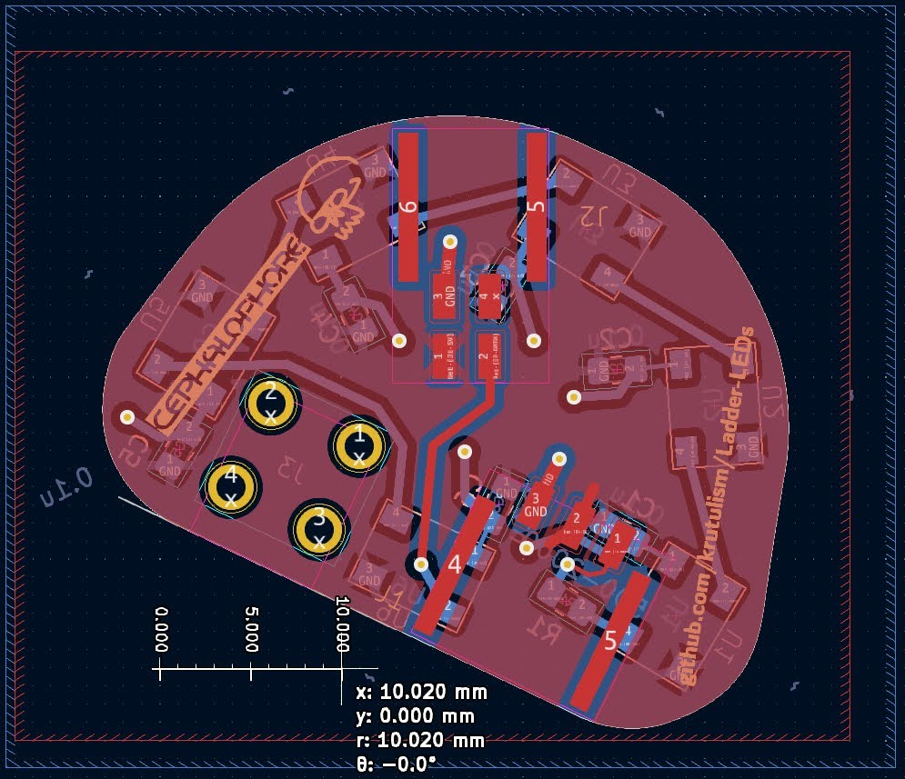
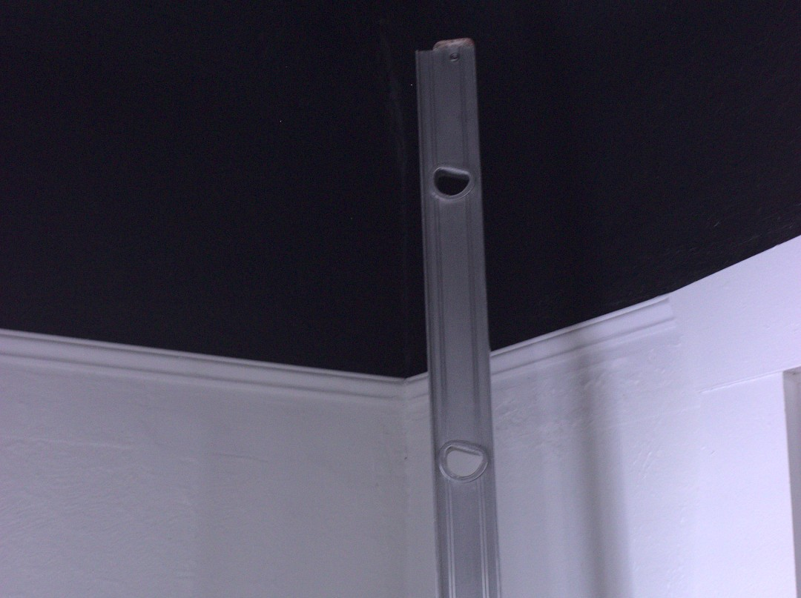
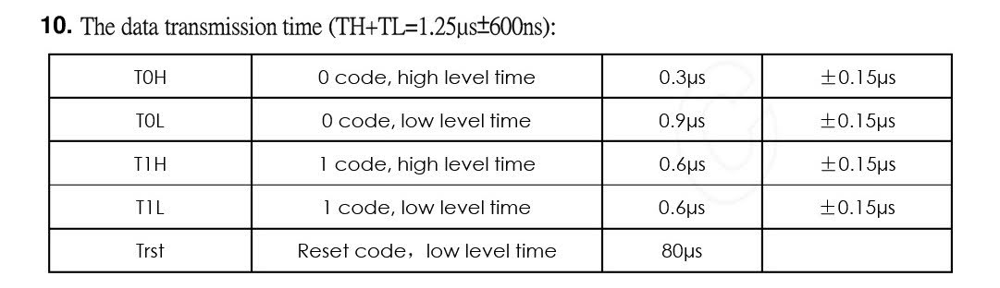
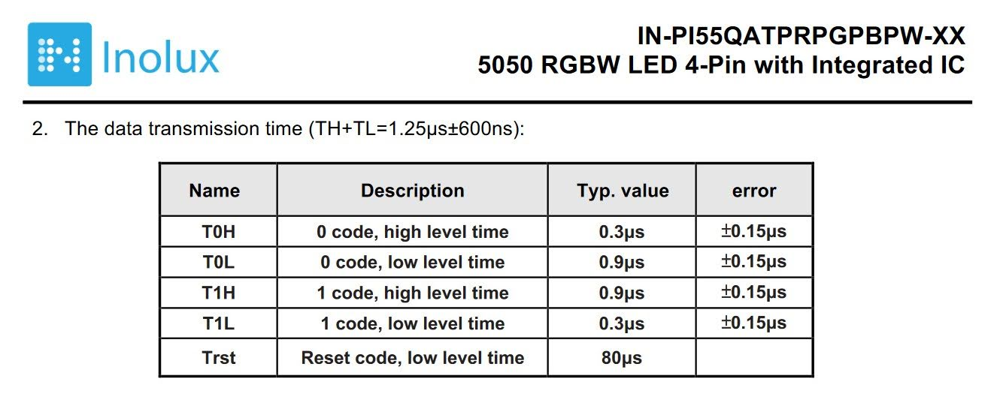

# Ladder-LEDs
KiCAD 7 files for a chainable PCB of individually addressable LEDs.

## Abstract
Strips of individually addressable LEDs are a popular and versatile gadget. Here I develop my own degree of craftsmanship beyond the adhesive strips they often come packaged on.

I used Molex connectors to chain together rigid fiberglass PCBs. The 'housing' that motivates the shape of the PCBs is the empty rungs of a salvaged aluminum extension ladder.

## Decision Tree
In each cut-off rung I will install a custom PCB designed in KiCAD.

The individually addressable LEDs I will use are the IN-PI55QATPRPGPBPW-40 RGBW shift register LEDs from Inolux.

The connector ecosystem that will allow me to chain these boards together are the Molex Nanofit system.

I will attempt to use a screw terminal block to mount the boards.

The prototype controller will be an Arduino.

## First Demo
[Test program video (Google photos link)](https://photos.app.goo.gl/88sZqstjhHEQxjQ36)

## Instructions
To correct the paths to 3D models of custom library components: select a footprint in the PCB editor, edit its properties in the right click context menu or by pressing the E key, and enter the "3D Models" tab

CAD models I derived from datasheet drawings are included. CAD models I downloaded from the manufacturer can be downloaded from manufacturer websites.

## Questions
My Arduino firmware treats these LEDs as SK6812RGBW LEDs, a common hobbyist standard. However, here is a table of data transmission times for SK6812s accessed at Adafruit:

and here is the table for the Inolux IN-PI55QATPRPGPBPW-40 LEDs I used

In scrubbing through the source libraries for [Adafruit Neopixel](https://github.com/adafruit/Adafruit_NeoPixel), which is used in my demo, I did not find where these transmission times are encoded. This leaves me wondering where my elision will break down, whether after adding more LEDs to the chain, or under a greater frequency of intensity change commands. I will keep scrubbing the source code to understand, but suggestions are welcome.

